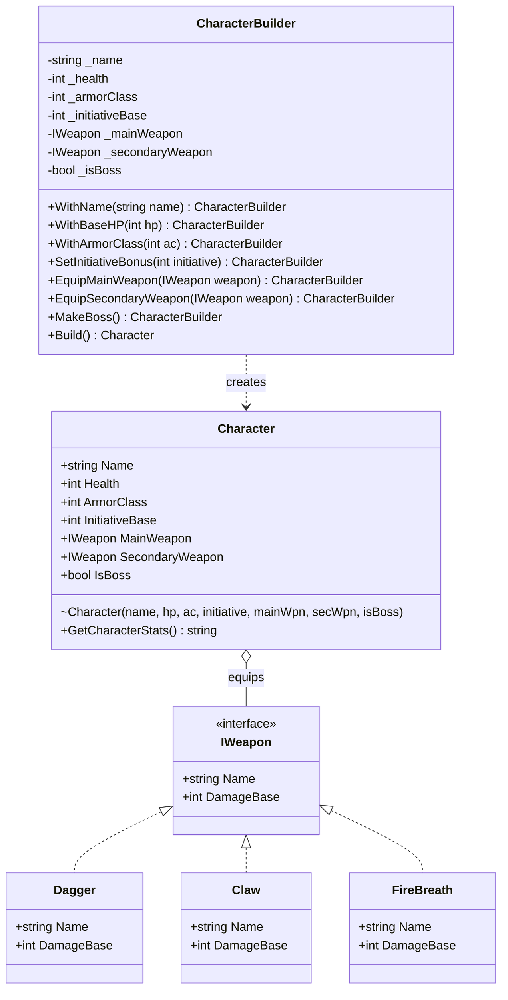

# Builder Design Pattern in C# (.NET 8)

[](https://dotnet.microsoft.com/)
[](https://learn.microsoft.com/en-us/dotnet/csharp/)
[](https://refactoring.guru/design-patterns/builder)
[](LICENSE)

A practical, clean, and educational implementation of the **Builder Design Pattern** in modern **C# (.NET 8)**, using a fantasy battle grid game character domain.

---

## 📖 Table of Contents

- [Overview](#-overview)
- [The Problem: Telescoping Constructor](#-the-problem-telescoping-constructor)
- [The Solution: Builder Pattern](#-the-solution-builder-pattern)
- [Architecture & Class Diagram](#-architecture--class-diagram)
- [Code Comparison](#-code-comparison)
- [Key Features](#-key-features)
- [Project Structure](#-project-structure)
- [Getting Started](#-getting-started)
- [When to Use the Builder Pattern](#-when-to-use-the-builder-pattern)
- [License](#-license)

---

## 🎯 Overview

The **Builder Pattern** is a creational design pattern from the Gang of Four (GoF). Its primary intent is to:

> *"Separate the construction of a complex object from its representation so that the same construction process can create different representations."*

In complex domain models (such as RPG battle units), entities often consist of many attributes—some required (name, HP) and many optional (main weapons, off-hand weapons, armor class, initiative modifiers, boss flags). Constructing these objects directly can quickly degrade into unmaintainable, error-prone code.

---

## ⚠️ The Problem: Telescoping Constructor

Without the Builder pattern, developers commonly resort to one of two anti-patterns:

1. **Telescoping Constructors**: Adding constructors with more and more parameters to accommodate variations.
2. **Forced `null` / Default Arguments**: Passing meaningless literals (`null`, `0`, `false`) to fill in optional parameters.

```csharp
// ❌ Hard to read and error-prone:
// What do '15', '12', '2', 'null', and 'false' mean?
// It's easy to accidentally swap '15' (HP) and '12' (AC) because both are integers!
Character goblin = new Character("Goblin Grunt", 15, 12, 2, new Dagger(), null, false);
```

### Major Pitfalls:
- **Poor Readability**: Readers cannot decipher what arbitrary numeric or boolean values represent without opening the constructor definition.
- **Type-Safety Blindspot**: When multiple adjacent arguments share the same type (e.g. `int health, int armorClass, int initiativeBase`), swapping them causes silent logical bugs without any compiler error.
- **Leaky Optionality**: Callers are forced to supply boilerplate `null` references and `false` booleans for unused optional components.

---

## 💡 The Solution: Builder Pattern

The Builder pattern introduces a dedicated `CharacterBuilder` class that constructs the `Character` object step-by-step using a **Fluent Interface** (method chaining):

```csharp
// ✅ Clean, self-documenting, and expressive:
Character goblin = new CharacterBuilder()
    .WithName("Goblin Grunt")
    .WithBaseHP(15)
    .WithArmorClass(12)
    .SetInitiativeBonus(2)
    .EquipMainWeapon(new Dagger())
    .Build();
```

### Advantages:
1. **Self-Documenting Code**: Each method call explicitly names the property being assigned (`.WithBaseHP(15)`, `.WithArmorClass(12)`).
2. **Omission of Optional Fields**: Secondary weapons and boss status default sensibly; no need to pass `null` or `false`.
3. **Immutability Preserved**: The `Character` class maintains `private set` properties, ensuring that the object cannot be mutated after creation.
4. **Centralized Validation**: Integrity rules (e.g., non-empty name, HP > 0) are validated in `.Build()` before the final object is instantiated.

---

## 📐 Architecture & Class Diagram



---

## 🔍 Code Comparison

| Aspect | ❌ Direct Constructor (Anti-Pattern) | ✅ Builder Pattern (Recommended) |
| :--- | :--- | :--- |
| **Clarity** | Opaque argument list (`"Dragon", 300, 18, 5, ...`) | Explicit, self-documenting method calls |
| **Swapped Arguments** | Easy to swap `hp` and `ac` silently | Impossible to swap; each has its own method |
| **Optional Properties** | Must pass `null` and `false` explicitly | Simply omit the method calls |
| **Validation** | Scattered or pushed into caller | Enforced centrally in `.Build()` |
| **Immutability** | Constructor or mutable setters | Fully immutable object returned |

### Side-by-Side Example

#### Without Builder:
```csharp
Character dragon = new Character(
    "Ancient Red Dragon", 
    300, 
    18, 
    5, 
    new Claw(), 
    new FireBreath(), 
    true
);
```

#### With Builder:
```csharp
Character dragon = new CharacterBuilder()
    .WithName("Ancient Red Dragon")
    .WithBaseHP(300)
    .WithArmorClass(18)
    .SetInitiativeBonus(5)
    .EquipMainWeapon(new Claw())
    .EquipSecondaryWeapon(new FireBreath())
    .MakeBoss()
    .Build();
```

---

## ⚡ Key Features

- **Fluent API**: Every configuration method in `CharacterBuilder` returns `this`, enabling clean chaining.
- **Fail-Fast Validation**: The `Build()` method verifies essential constraints (e.g., name is not blank, health > 0) before instantiating the object:
  ```csharp
  if (string.IsNullOrWhiteSpace(_name))
      throw new InvalidOperationException("Failed to build character: Name cannot be null or empty.");

  if (_health <= 0)
      throw new InvalidOperationException("Failed to build character: HP must be greater than 0.");
  ```
- **Encapsulated Constructor**: The `Character` constructor is marked `internal`, guiding team members and consumers to always use the builder rather than instantiating the class directly.
- **Composable Sub-components**: Integrates the `IWeapon` abstraction, demonstrating how complex sub-objects can be plugged in during construction.

---

## 📂 Project Structure

```text
BuilderDesignPattern/
├── Builders/
│   └── CharacterBuilder.cs        # Fluent Builder implementation & validation
├── Interface/
│   └── IWeapon.cs                 # Weapon component abstraction
├── Models/
│   ├── Character/
│   │   └── Character.cs           # Immutable Product class
│   └── Weapon/
│       ├── Claw.cs                # Concrete weapon (Dragon Claw)
│       ├── Dagger.cs              # Concrete weapon (Rusty Dagger)
│       └── FireBreath.cs          # Concrete weapon (AoE Fire Breath)
├── Program.cs                     # Entry point comparing both approaches
├── BuilderDesignPattern.csproj    # .NET 8 Project file
└── README.md                      # Project documentation
```

---

## 🚀 Getting Started

### Prerequisites
* [.NET 8.0 SDK](https://dotnet.microsoft.com/download/dotnet/8.0) or later.

### Clone and Run

1. Clone the repository:
   ```bash
   git clone https://github.com/your-username/BuilderDesignPattern.git
   cd BuilderDesignPattern
   ```

2. Build the solution:
   ```bash
   dotnet build
   ```

3. Run the console application:
   ```bash
   dotnet run --project BuilderDesignPattern
   ```

### Expected Output

```text
================================================================
 1. WITHOUT BUILDER PATTERN (Telescoping Constructor Anti-Pattern)
================================================================

--- UNIT: Goblin Grunt ---
HP: 15 | AC: 12 | Initiative: +2
Main Wpn: Rusty Dagger
Sec Wpn: None

--- BOSS: Ancient Red Dragon ---
HP: 300 | AC: 18 | Initiative: +5
Main Wpn: Dragon Claw
Sec Wpn: Fire Breath

================================================================
 2. USING BUILDER PATTERN (Fluent Step-by-Step Construction)
================================================================

--- UNIT: Goblin Grunt ---
HP: 15 | AC: 12 | Initiative: +2
Main Wpn: Rusty Dagger
Sec Wpn: None

--- BOSS: Ancient Red Dragon ---
HP: 300 | AC: 18 | Initiative: +5
Main Wpn: Dragon Claw
Sec Wpn: Fire Breath
```

---

## 🧠 When to Use the Builder Pattern

### ✅ Use the Builder pattern when:
- An object has a large number of parameters (usually 4+), many of which are optional.
- You want to construct immutable objects without exposing public setters.
- The creation process must allow different representations for the object (e.g. Grunt vs Boss, Archer vs Mage).
- Validation must happen as a unified step before the object is made available to the rest of the application.

### ❌ Avoid the Builder pattern when:
- The object is simple with only 1–3 mandatory fields and no optional variations.
- The object is an active Data Transfer Object (DTO) or entity whose properties are freely mutated over time.

---

## 📄 License

This project is licensed under the [MIT License](LICENSE). Feel free to use it for educational purposes, study, and project references!
